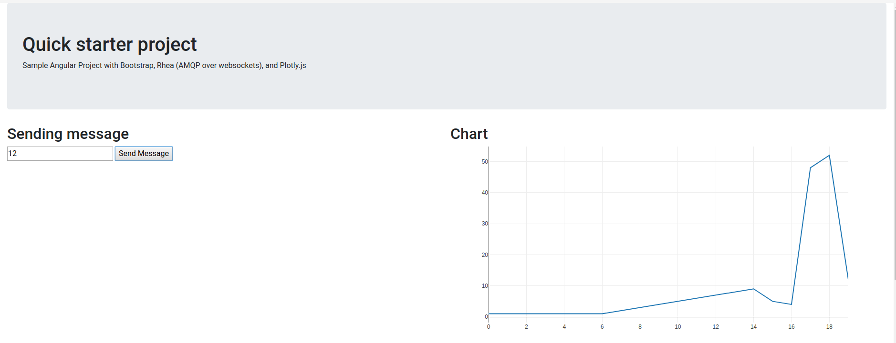

# Demo of an HTML 5 Angular application with Active MQ & Fuse backend

This demos shows how Angular 5 configured with Bootstrap, plotly.js for charts and plots can interact with a back end application such as Fuse through Websockets

Graphs update in real time as messages are sent from the backend to the browser.

## Prerequisites

* Have npm installed (optional, only needed if you want to change and rebuild the angular app)
* Install [angular-cli](https://angular.io/guide/quickstart) : `npm install -g @angular/cli` (optional)

* Have maven installed
  * use the following maven settings  to enable  the right repositories
    * fuseapp/configuration/settings.xml

## Easiest way to run the demo

The angular app is already built and will be served statically by the fuse/spring-boot application. Files are in resources/static.

    cd fuse-websockets
    mvn --settings configuration/settings.xml spring-boot:run

Open your browser at http://localhost:8080/

## If you want to customize and rebuild the angular app

    cd angularapp
    npm install

To rebuild the application

    ng build

To start serving the application

    ng serve

## How to build the angular app from scratch

See the following template :
    https://github.com/alainpham/angular-amq-bootstrap-template
